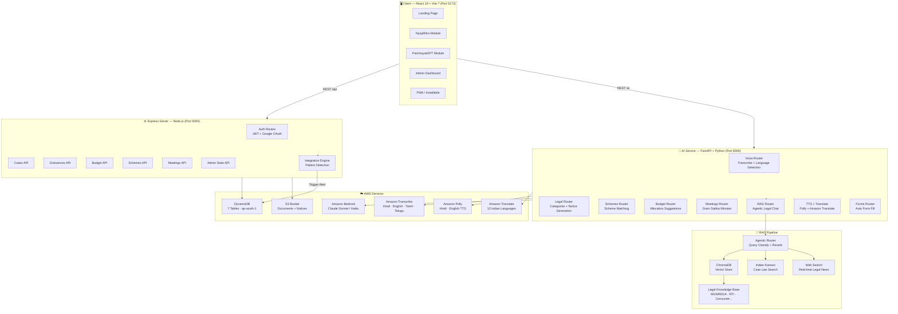
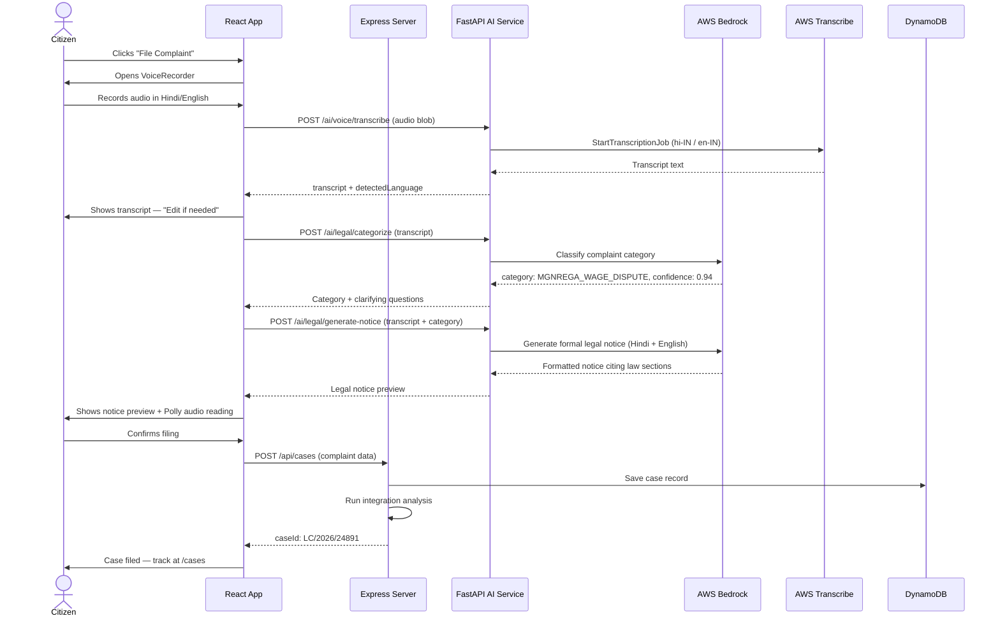
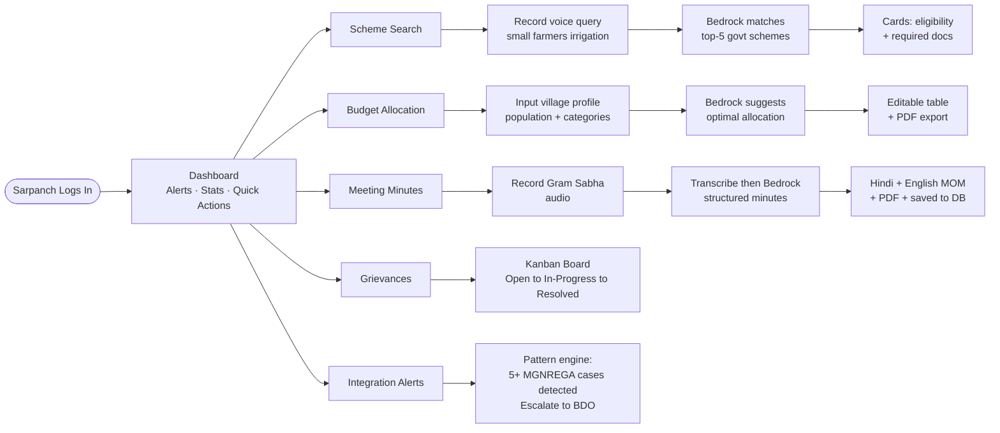
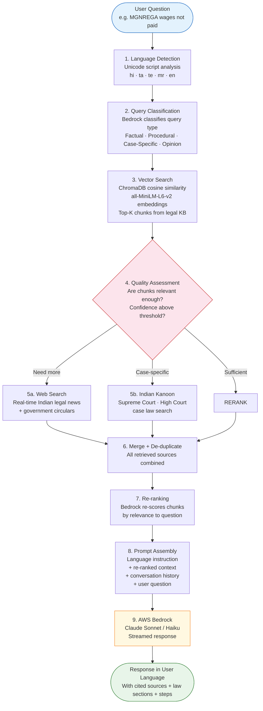
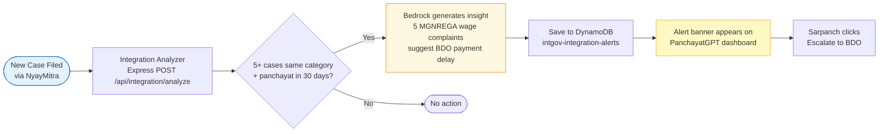

<div align="center">

# 🇮🇳 IntegratedGov AI — AI for Bharat


**Two AI modules. One integrated platform. Built for 600,000 panchayats.**

[](https://react.dev)
[](https://fastapi.tiangolo.com)
[](https://aws.amazon.com/bedrock)
[](https://aws.amazon.com/dynamodb)
[](https://web.dev/progressive-web-apps)

</div>

---

## What Is This?

India's panchayat governance is broken across two dimensions: **citizens can't file legal complaints** without a lawyer, and **sarpanches can't navigate 400+ government schemes** without expertise.

We solve both — in one integrated platform — using AWS Bedrock (Claude), voice input, multilingual AI, and a RAG pipeline grounded in Indian law.

| Module | Who Uses It | What It Does |
|---|---|---|
| **NyayMitra** | Citizens | Voice → AI legal notice → file complaint → case tracking |
| **PanchayatGPT** | Sarpanches | Voice scheme search · AI budgets · meeting minutes · grievances |
| **Integration Engine** | Both | Detects cross-module patterns (e.g. 5 MGNREGA cases → auto-alert) |

---

## System Architecture



---

## User Flow — NyayMitra (Legal Aid)



---

## User Flow — PanchayatGPT (Village Governance)



---

## How RAG Works

The legal chat (`/ai/rag`) uses an **Agentic RAG** pipeline — the AI doesn't blindly retrieve; it *reasons* about what retrieval strategy to use before answering.



### Knowledge Base (seeded at startup)

| Category | Source |
|---|---|
| MGNREGA | Act 2005 — rights, complaint steps, wage timelines |
| RTI | RTI Act 2005 — how to file, timelines, exemptions |
| Consumer Protection | Consumer Protection Act 2019 |
| Land Rights | Land Acquisition Act |
| Domestic Violence | PWDVA 2005 — protection orders, shelters |
| SC/ST Rights | SC/ST (Prevention of Atrocities) Act |
| Child Labour | Child Labour Act, POCSO |
| Labour Law | Minimum Wages, ESI, PF, contract labour |
| Panchayat Powers | 73rd Amendment, Gram Sabha rights |
| Government Schemes | PM-Kisan, Ayushman Bharat, PMAY, PMGSY, PMJDY |

---

## Integration Engine

The platform's key differentiator — a complaint filed by a citizen in **NyayMitra** automatically informs the Sarpanch in **PanchayatGPT**, closing the loop between individual grievance and village accountability.



---

## Features

### NyayMitra — Legal Aid for Citizens
- **Voice Complaint Filing** — Speak in Hindi, English, Tamil, Telugu, Marathi; AI transcribes via Amazon Transcribe
- **AI Legal Notice Generation** — Bedrock (Claude) generates attorney-quality notices citing exact law sections (MGNREGA §7, Consumer Protection Act §35, etc.)
- **Smart Recipient Resolution** — Before showing email fields, the AI reads the complaint transcript and determines *who* should actually receive the notice. Complaint types are classified into three modes:
  - 🏛 **Government** (RTI, MGNREGA, Public Nuisance, Police Misconduct, etc.) — relevant authority emails auto-filled instantly, no LLM call needed
  - 👤 **Private Party** (landlord-tenant, salary dispute, interpersonal conflict) — no government authority pre-filled; a single blank field appears labelled contextually (e.g. *"Employer / Company"*) for the complainant to enter the other party's email
  - ⚖ **Mixed** (domestic violence, labour dispute with employer, cyber crime) — authority emails pre-filled AND an additional blank **OTHER PARTY** field added for the private party's email
- **Multi-Recipient Dispatch** — Notice sent simultaneously to all filled email addresses in one click. Recipients can be added with `+`, removed with `×`, or edited at any time before sending.
- **Authority Database** — Built-in mapping of all 20 complaint categories to responsible government authorities (Municipal Corporations, District Collectors, RTI PIOs, NHRC, NCPCR, NGT, Labour Commissioner, etc.). All placeholder emails use the RFC 2606-reserved `.example` TLD in demo mode — guaranteed non-deliverable to any real inbox.
- **Section 65B Evidence Act Certificate** — Generated automatically after every digital dispatch. Includes server timestamp, IP address, and message ID — making the delivery admissible as primary electronic evidence in Indian courts.
- **eSign (IT Act 2000)** — Aadhaar-OTP based digital signature flow; signed notices carry a legally valid signature block before dispatch.
- **Case Tracking** — Timeline view with status badges: Filed → Under Review → Notice Sent → Resolved
- **Polly Audio Playback** — Legal notice read aloud in the user's language (critical for low-literacy users)
- **eCourt Integration** — Auto-generates official case reference numbers (mock eCourt filing)
- **Document Storage** — Notices uploaded to S3, presigned download URLs returned

### PanchayatGPT — Village Governance AI
- **Voice Scheme Search** — Speak a need, get matched government schemes with eligibility and required documents
- **AI Budget Allocation** — Input village demographics, get Bedrock-optimised category-wise budget breakdown
- **Meeting Minutes Automation** — Record Gram Sabha audio → structured bilingual minutes in seconds → PDF export + history
- **Past Meetings Archive** — All MOMs stored in DynamoDB; restore any past meeting with one click
- **Grievance Kanban** — Visual pipeline: Open → In Progress → Resolved

### Agentic Legal RAG Chat
- Multi-step reasoning — classifies query type before choosing retrieval strategy
- Indian Kanoon integration — pulls real Supreme Court / High Court precedents
- Web search fallback — searches real-time Indian legal news when KB is insufficient
- Multilingual — detects input language (Unicode script analysis), responds in same language
- Context-window management — caps history to prevent prompt overflow

### Admin Dashboard — Full Platform Control

A fully tabbed admin interface with live data pulled straight from DynamoDB:

| Tab | What admin sees |
|-----|-----------------|
| **Overview** | Stat cards (total cases, grievances, meetings, active panchayats) · 6-month trend line chart · case-type distribution bar chart · live integration alert feed with severity colours · auto-refreshes every 30s |
| **Complaints** | All NyayMitra complaints in a searchable, filterable table (filter by status: Filed / In Progress / Resolved) with complainant name, email, complaint gist, area, and filing date |
| **Complaint Detail** | Slide-in side panel: full description / legal notice text · complainant info (name, email, phone) · case metadata (law cited, panchayat, dispatch timestamp, Aadhaar masked) · complete event timeline |
| **Follow-up Email** | Admin can send a follow-up email to any complainant directly from the panel — auto-fills recipient email, sends via nodemailer, and writes an audit event on the case timeline |
| **Grievances** | All panchayat grievances across DynamoDB with priority badges (High / Medium / Low), status badges (New / Assigned / Resolved), and submitter info |
| **Meetings** | Card grid of all Gram Sabha meetings; click any card to open the **Meeting Minutes detail panel** |
| **Meeting Minutes Panel** | Full AI-generated minutes: agenda items · key decisions · action items (assignee + deadline) · schemes discussed (badge chips) · funds approved · next meeting date · Hindi summary · original transcript |
| **Budget** | All panchayat budget records with per-category spend progress bars; bars turn amber at 70% and red at 90% utilisation |

**Login hint** — A 🔑 *Admin Demo Access* card is pinned to the top-right corner of the Login page. Clicking it auto-fills `admin@gmail.com` / `admin` and switches the form to Email Login mode — one more click to enter.

### Multilingual (12 Languages)
Amazon Translate + Polly + Transcribe cover: `hi` `en` `ta` `te` `mr` `bn` `gu` `kn` `ml` `pa` `or` `ur`

### PWA — Installable App
Works offline for cached pages; installable on Android/iOS home screen — critical for low-connectivity rural India.

---

## Tech Stack

| Layer | Technology |
|---|---|
| **Frontend** | React 19 · Vite 7 · Tailwind CSS · Recharts · Lucide |
| **Backend** | Express 4 · Node.js · JWT · bcrypt · Passport (Google OAuth) |
| **AI Service** | FastAPI · Python 3.11 · Pydantic · Uvicorn |
| **LLM** | Amazon Bedrock — Claude 3 Sonnet / Haiku |
| **Voice** | Amazon Transcribe (hi-IN · en-IN · ta-IN · te-IN) · Amazon Polly |
| **Translation** | Amazon Translate (12 languages) |
| **Vector DB** | ChromaDB (persistent) · all-MiniLM-L6-v2 embeddings |
| **Database** | Amazon DynamoDB · single-table design · ap-south-1 |
| **Storage** | Amazon S3 · presigned URLs |
| **Auth** | JWT (7d expiry) · Google OAuth 2.0 |
| **PWA** | vite-plugin-pwa · Workbox |

---

## DynamoDB Tables

| Table | PK / SK | Purpose |
|---|---|---|
| `intgov-users` | `USER#email` / `PROFILE` | Auth, profiles, roles |
| `intgov-cases` | `CASE#id` / metadata | NyayMitra complaints |
| `intgov-grievances` | `GRIEVANCE#id` / metadata | Village grievances |
| `intgov-budget` | `BUDGET#panchayatId` / year | Budget records |
| `intgov-schemes` | `SCHEME#id` / metadata | Government schemes catalog |
| `intgov-integration-alerts` | `panchayatId` / `ts#...` | Cross-module pattern alerts |
| `intgov-meetings` | `panchayatId` / `ts#...` | Gram Sabha MOMs |

---

## Project Structure

```
Prototype_AI_for_Bharat/
├── client/                     # React 19 + Vite (port 5173)
│   ├── src/
│   │   ├── pages/
│   │   │   ├── nyaymitra/      # FileComplaint · Cases · CaseDetail
│   │   │   └── panchayat/      # SchemeSearch · Budget · MeetingMinutes · Grievances
│   │   ├── components/         # VoiceRecorder · AlertPanel · DailyLegalDose · layout
│   │   └── context/            # Auth · Language · Theme
│   └── public/                 # PWA icons
│
├── server/                     # Express + Node.js (port 5000)
│   ├── routes/                 # auth · cases · grievances · budget · schemes
│   │                             meetings · integration · admin · ecourt
│   ├── middleware/             # JWT auth guard
│   └── config/                 # DynamoDB client + table name constants
│
└── ai-service/                 # FastAPI + Python (port 8000)
    ├── routers/                # voice · legal · schemes · budget · meetings
    │                             integration · rag · translate · tts · forms
    └── rag/                    # agent · retrieval · vectorstore · knowledge_base
                                  chunking · indian_kanoon · web_search
```

---

## Getting Started

### Prerequisites
Node.js 20+ · Python 3.11+ · AWS account with Bedrock model access enabled

### 1. Clone & install

```bash
git clone <repo-url>
cd Prototype_AI_for_Bharat

npm install                              # root (concurrently)
cd client  && npm install && cd ..
cd server  && npm install && cd ..
cd ai-service && pip install -r requirements.txt && cd ..
```

### 2. Environment variables

**`server/.env`**
```env
PORT=5000
JWT_SECRET=change-me-in-production
AWS_REGION=ap-south-1
AWS_ACCESS_KEY_ID=AKIA...
AWS_SECRET_ACCESS_KEY=...
TABLE_USERS=intgov-users
TABLE_CASES=intgov-cases
TABLE_GRIEVANCES=intgov-grievances
TABLE_BUDGET=intgov-budget
TABLE_SCHEMES=intgov-schemes
TABLE_ALERTS=intgov-integration-alerts
TABLE_MEETINGS=intgov-meetings
S3_BUCKET=intgov-documents-dev
CLIENT_URL=http://localhost:5173
GOOGLE_CLIENT_ID=          # optional — Google OAuth
GOOGLE_CLIENT_SECRET=      # optional
```

**`ai-service/.env`**
```env
AWS_REGION=us-east-1
AWS_ACCESS_KEY_ID=AKIA...
AWS_SECRET_ACCESS_KEY=...
BEDROCK_MODEL_ID=anthropic.claude-3-5-sonnet-20241022-v2:0
BEDROCK_HAIKU_MODEL_ID=anthropic.claude-3-haiku-20240307-v1:0
```

### 3. Provision DynamoDB tables

```bash
cd server && node setup-tables.js
```

### 4. Create admin account

```bash
node create-admin.js admin@example.com yourpassword "Admin User"
```

### 5. Run all three services

```bash
# From repo root — starts Vite + Express + FastAPI concurrently
npm run dev
```

| Service | URL |
|---|---|
| Frontend | http://localhost:5173 |
| Express API | http://localhost:5000 |
| FastAPI AI | http://localhost:8000/docs |

---

## Demo Walkthrough

| Role | Login | What to demonstrate |
|---|---|---|
| Citizen (Ramesh) | `citizen@demo.com` / `demo123` | File voice complaint in Hindi → see AI notice → case number issued |
| Sarpanch (Sunita) | `sarpanch@demo.com` / `demo123` | Scheme voice search · AI budget · Record Gram Sabha · Integration alert |
| Admin | `admin@gmail.com` / `admin` | Live stats · all complaints table · complaint detail panel · send follow-up email · grievances · meeting minutes · budget spend breakdown |

**Integration demo trigger:** File 5 MGNREGA cases from the same panchayat → watch the cross-module alert appear on the Sarpanch dashboard automatically.

---

## API Reference

| Service | Endpoint | Method | Description |
|---|---|---|---|
| Express | `/api/auth/signup` | POST | Register user (citizen / sarpanch) |
| Express | `/api/auth/login` | POST | Login → JWT token |
| Express | `/api/cases` | POST / GET | File or list complaints |
| Express | `/api/cases/:id/dispatch-email` | POST | Dispatch notice to one or multiple recipients; returns Section 65B metadata |
| Express | `/api/grievances` | POST / GET / PATCH | Village grievances CRUD |
| Express | `/api/meetings` | POST / GET / DELETE | Gram Sabha MOMs |
| Express | `/api/admin/stats` | GET | Live dashboard aggregates (stats, charts, alerts) |
| Express | `/api/admin/cases` | GET | All complaints with merged user details + complaint gist |
| Express | `/api/admin/cases/:id` | GET | Full complaint detail — description, legal notice, timeline events |
| Express | `/api/admin/cases/:id/followup` | POST | Send follow-up email to complainant + write timeline event |
| Express | `/api/admin/grievances` | GET | All panchayat grievances across DynamoDB |
| Express | `/api/admin/meetings` | GET | Lightweight list of all Gram Sabha meetings |
| Express | `/api/admin/meetings/:panchayatId/:sk` | GET | Full meeting detail including AI-generated minutes |
| Express | `/api/admin/budget` | GET | All panchayat budget records |
| Express | `/api/integration/analyze` | POST | Trigger pattern detection |
| AI | `/ai/voice/transcribe` | POST | Audio file → text (Transcribe) |
| AI | `/ai/legal/categorize` | POST | Transcript → complaint category |
| AI | `/ai/legal/generate-notice` | POST | Transcript + category → legal notice |
| AI | `/ai/legal/resolve-recipients` | POST | Transcript + category → recipient type (`government`\|`private`\|`mixed`) + contextual labels; government-scope categories resolved instantly without LLM; mixed/ambiguous categories invoke Bedrock |
| AI | `/ai/schemes/search` | POST | Voice query → matched schemes |
| AI | `/ai/budget/suggest` | POST | Village profile → allocation |
| AI | `/ai/meetings/generate-minutes` | POST | Transcript → Gram Sabha minutes |
| AI | `/ai/rag/chat` | POST | Agentic multilingual legal chat |
| AI | `/ai/tts/synthesize` | POST | Text → Polly MP3 audio |
| AI | `/ai/translate` | POST | Text → target language |

Full interactive API docs available at `http://localhost:8000/docs` (FastAPI Swagger UI).

---

<div align="center">

Built for **AI for Bharat Hackathon** by **Team Gryffindor_**

*"Technology that empowers the last mile."*

</div>
